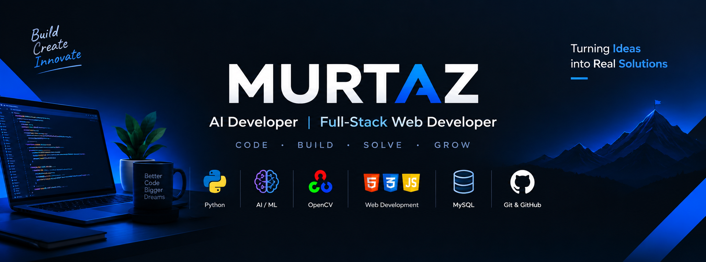

  

    

  <h1>Murtaz</h1>

  

    
    
  

  

    <b>Building practical solutions with Artificial Intelligence, Machine Learning, Computer Vision, Robotics and Web Development.</b>
  

  

    <a href="#about-me"><code>About Me</code></a> &nbsp;•&nbsp;
    <a href="#areas-of-focus"><code>Areas of Focus</code></a> &nbsp;•&nbsp;
    <a href="#tech-stack"><code>Tech Stack</code></a> &nbsp;•&nbsp;
    <a href="#featured-projects"><code>Featured Projects</code></a> &nbsp;•&nbsp;
    <a href="#github-activity"><code>GitHub Activity</code></a> &nbsp;•&nbsp;
    <a href="#connect"><code>Connect</code></a>
  

 

---

## 👤 About Me

I’m a **BS Artificial Intelligence student** and **Full-Stack Web Developer** interested in building practical software and exploring intelligent systems.

I enjoy learning by building real projects and experimenting with new technologies. My focus spans exploring intelligent algorithms, experimenting with computer vision pipelines, studying robotics, and engineering clean, responsive web applications.

---

## 🎯 Areas of Focus

<table width="100%">
  <tr>
    <td width="33.3%" valign="top">
      <h4>🤖 Artificial Intelligence</h4>
      
Studying intelligent systems, algorithm design, and applied computational problem-solving.

    </td>
    <td width="33.3%" valign="top">
      <h4>🧠 Machine Learning</h4>
      
Learning, developing, and exploring core ML concepts, predictive algorithms, and data-driven models.

    </td>
    <td width="33.3%" valign="top">
      <h4>👁️ Computer Vision</h4>
      
Extracting features, transforming visual data, and experimenting with image processing pipelines using OpenCV.

    </td>
  </tr>
  <tr>
    <td width="33.3%" valign="top">
      <h4>🦾 Robotics</h4>
      
Exploring robotics, intelligent systems, automation, and hardware-software integration.

    </td>
    <td width="66.7%" colspan="2" valign="top">
      <h4>🌐 Full-Stack Web Development</h4>
      
Building responsive frontends, designing structured relational databases, and crafting clean web interfaces.

    </td>
  </tr>
</table>

---

## ⚡ Tech Stack

<table width="100%">
  <tr>
    <td width="50%" valign="top">
      <h4>💻 Programming Languages</h4>
      
<b>Python</b> · <b>C++</b> · <b>JavaScript</b> · <b>PHP</b>

      
    </td>
    <td width="50%" valign="top">
      <h4>🧠 AI & Data</h4>
      
<b>NumPy</b> · <b>Pandas</b> · <b>OpenCV</b> · <b>Machine Learning</b>

      
    </td>
  </tr>
  <tr>
    <td width="50%" valign="top">
      <h4>🌐 Web Development</h4>
      
<b>HTML</b> · <b>CSS</b> · <b>Bootstrap</b> · <b>MySQL</b> · <b>WordPress</b>

      
    </td>
    <td width="50%" valign="top">
      <h4>🛠️ Tools & Environments</h4>
      
<b>Git</b> · <b>GitHub</b> · <b>VS Code</b> · <b>Postman</b>

      
    </td>
  </tr>
</table>

---

## 🚀 Featured Projects

<table width="100%">
  <tr>
    <td width="50%" valign="top">
      <h3>🌤️ Weather CLI</h3>
      
A Python command-line weather application using WeatherAPI for real-time meteorological lookups, structured forecasts, and data visualization.

      
<b>Built with:</b> <code>Python</code> · <code>Requests</code> · <code>REST API</code> · <code>Matplotlib</code>

      

        
      

    </td>
    <td width="50%" valign="top">
      <h3>💰 Expense Tracker</h3>
      
A Python-based expense management application designed for streamlined personal financial tracking, budget logs, and persistent CSV storage.

      
<b>Built with:</b> <code>Python</code> · <code>CSV</code> · <code>File Handling</code>

      

        
      

    </td>
  </tr>
  <tr>
    <td width="50%" valign="top">
      <h3>👁️ Computer Vision</h3>
      
Computer vision experiments and applications exploring image processing pipelines, thresholding, edge filtering, and visual feature extraction.

      
<b>Built with:</b> <code>Python</code> · <code>OpenCV</code>

      

        
      

    </td>
    <td width="50%" valign="top">
      <h3>🦾 Robotics & Intelligent Systems</h3>
      
Exploring robotics, intelligent systems, automation, and hardware-software integration as part of ongoing studies and experimentation.

      
<b>Built with:</b> <code>Python</code> · <code>C++</code> · <code>Intelligent Systems</code>

      

        
      

    </td>
  </tr>
</table>

---

## 🌱 Currently Building & Learning

- 💻 **Active Engineering**: Actively building Python projects and progressing toward applied AI/ML and Computer Vision implementations.
- 🎯 **Continuous Learning**: Learning and developing core concepts in **Machine Learning**, while exploring **Artificial Intelligence**, **Computer Vision**, and **Robotics**.
- 🌐 **Full-Stack Development**: Engineering responsive web interfaces and backend functionality to connect software solutions with practical applications.

---

## 📊 GitHub Activity

  <table border="0">
    <tr>
      <td align="center" valign="middle">
        
      </td>
      <td align="center" valign="middle">
        
      </td>
    </tr>
    <tr>
      <td align="center" colspan="2">
        
      </td>
    </tr>
  </table>

---

## 📫 Connect

Feel free to connect or explore my work on GitHub:

  

---

**Build · Learn · Grow**  
*“Turning ideas into real solutions.”*

